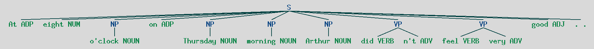
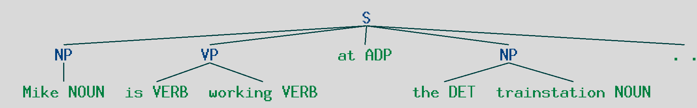
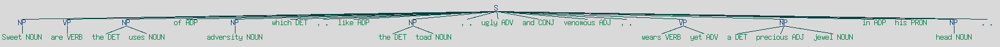

# Syntaxic_tree_generator

## Instruction 

The assignment consists in the development, in NLTK a pipeline that, starting from a text in input, in a given language (English, French, German and Italian are admissible) outputs the syntactic tree of the sentence itself, intended as a tree with root in S for sentence, and leaves on the tokens labelled with a single Part-of-speech. The generation of the tree will pass through the following models:

PURE SYMBOLIC. The tree is generated by a LR analysis with CF LL2 grammar as a base. Candidates can assume the following:

- Adjectives in English and German shall be only prefixed to nouns, whilst in French and Italian are only suffixed;
- Verbs are all at present tense;
- No pronouns are admitted;
- Only one adverb is admitted, always post-poned with respect to the verb (independently of the language, and the type of adverb);
  
Overall the point above map a system that could be devised in regular expressions, but a Context-free grammar would be simpler to define. Candidate can either define a system by themselves or use a syntactic tree generation system that can be found on GitHub. Same happens for POS-tagging, where some of the above mentioned systems can be customized by existing techniques that are available in several fashions (including a pre-defined NLTK and OpenNLP libraries for POS-tagging and a module in GATE for the same purpose). Ambiguity should be blocked onto first admissible tree.

## Implementation
Each words of a sentence will be taged with it types. The universal tag have been choosen because it have more generic tag and process more possible case.

Then this continuation of tag will be parsed by a simple grammar:  
```py
grammar = r'''
    NP: {<DET>?<ADJ>*<NOUN>}
    VP: {<VERB.*>+<ADV>?} 
'''
```
Where `NP` is a noun phrase with a determinant or not followed by 0 to N adjectives and a noun.  
And `VP` is a verbal phrase a verb or an adjectiv or both.  
  
The parsing will result in a tree that will be finally drawn.

## Results
This code will work only in english because it uses the `pos_tag` function of nltk that works only in english by default.  
And all the tag that don't feat with the description of the grammar will just be ignored and put as a simple leaf.

It has been test on few sentences:  
- "At eight o'clock on Thursday morning Arthur didn't feel very good."
  - 
- "I am waking up"
  - 
- "Mike is working at the trainstation."
  - 

And on a more complicated one thanks to shakespear:  
- "Sweet are the uses of adversity which, like the toad, ugly and venomous, wears yet a precious jewel in his head."
  - 

So it works well on all sentences but the grammar is too simple to detect all the forms used in english.
